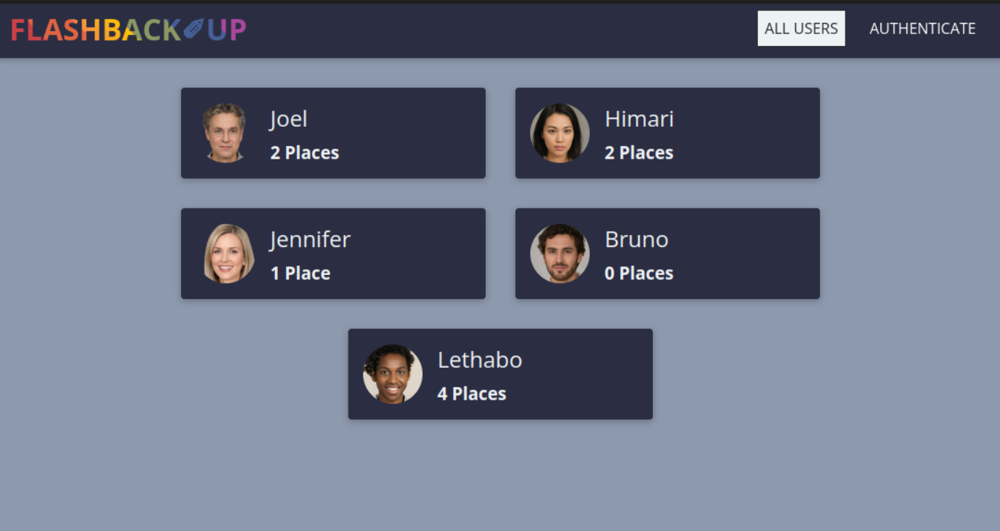
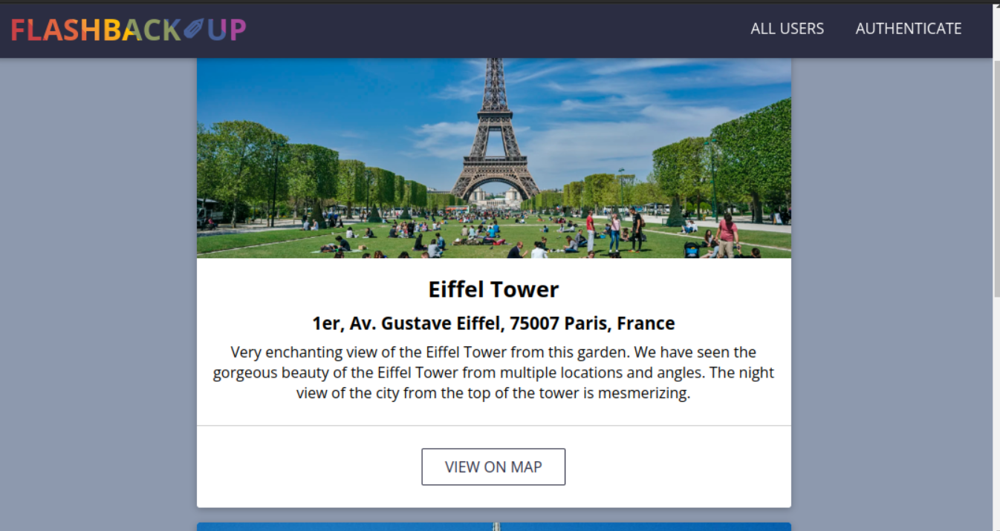
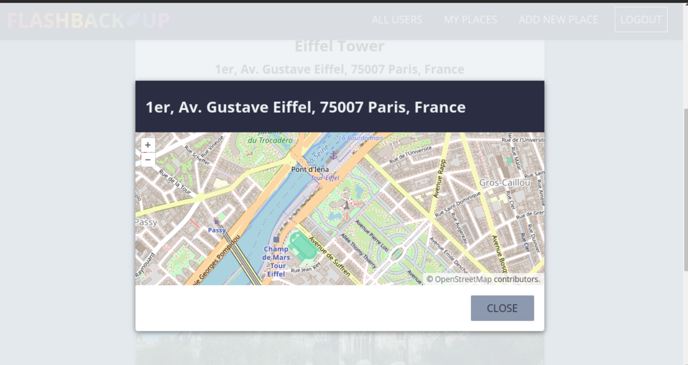
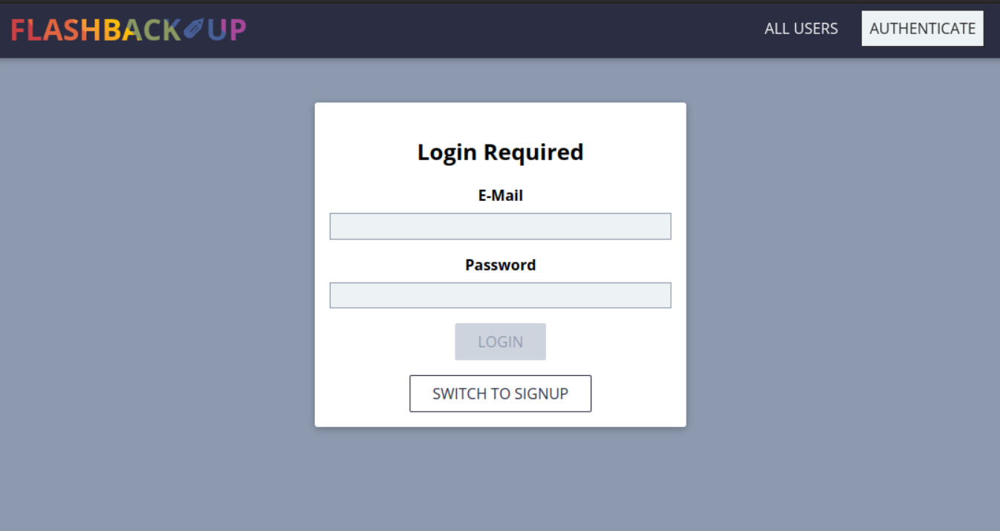
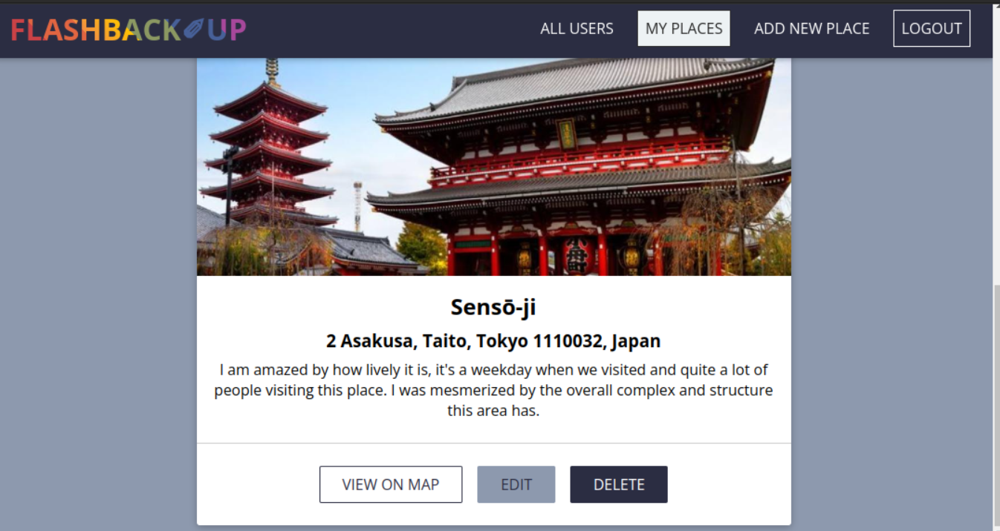

# Flashback-Up

Flashback-Up allows users to store remarkable places that they would like to memorize and share with the community.

## Features of App

- Every user can browse places collected by other users but is not allowed to edit or delete them.
- Every user should sign in (name, avatar image upload, email, password) to create their own places collection.
- An authenticated user can create a new place with a name, description, photo, and address.
- An authenticated user can edit name and description of places and also can delete places.
- The app allows users to observe every place on the map.

## Tech Stack

- React.js
- React Router
- Axios
- Node.js
- Express.js
- MongoDB
- Mongoose
- bcrypt.js
- jsonwebtoken

### Short demovideo


### Pages







## Setup

Install dependencies and run app

### Frontend

```
cd frontend
npm install
npm start
```

### Backend

```
cd backend
npm install
npm start
```
